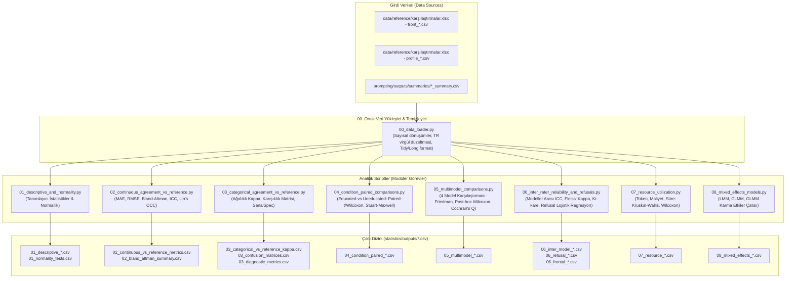

# Ortognatik Cerrahi AI Değerlendirmesi — İstatistiksel Analiz Planı (`plan.md`)

Bu plan, [`statistics/task.md`](task.md) dosyasında tanımlanan tüm istatistiksel analiz hedeflerini bağımsız, modüler ve tekrarlanabilir Python scriptlerine (`.py`) bölmek amacıyla hazırlanmıştır.

Her script bağımsız olarak çalıştırılabilir olacak, girdi verilerini [`data/reference/`](../../data/reference/) ve [`prompting/outputs/summaries/`](../../prompting/outputs/summaries/) altından alacak ve ürettiği tüm istatistiksel sonuçları [`statistics/outputs/`](outputs/) dizinine standart `.csv` formatında kaydedecektir.

---

## 1. Mimari ve Veri Akışı Genel Bakışı

---

## 2. Modüler Script Dağılımı ve Görev Tanımları

### Script 00: `00_data_loader.py` (Ortak Veri Hazırlığı Modülü)
* **Amaç:** Diğer tüm scriptlerin veri tutarlılığını sağlamak, Türkçe ondalık virgüllerini (`"-1,5"` $\rightarrow$ `-1.5`), hasta adlarındaki olası yazım farklılıklarını ve kategorik kodlamaları standartlaştırmak.
* **Girdi Dosyaları:**
  * `data/reference/karşılaştırmalar.xlsx - front_educated.csv`
  * `data/reference/karşılaştırmalar.xlsx - front_uneducated.csv`
  * `data/reference/karşılaştırmalar.xlsx - profile_educated.csv`
  * `data/reference/karşılaştırmalar.xlsx - profile_uneducated.csv`
  * `prompting/outputs/summaries/*.csv` (kaynak metrikleri için)
* **İşlevler:**
  * `load_cleaned_profile_data()`: Profil cerrahi plan ve tanı verilerini sayısal float formatında döndürür.
  * `load_cleaned_front_data()`: Frontal deviasyon verilerini döndürür.
  * `load_resource_data()`: Token, maliyet, süre ve hata verilerini döndürür.
  * `build_tidy_dataset()`: Karma modeller için hasta-içi tekrarlı ölçümleri uzun (long) formatta birleştirir.

---

### Script 01: `01_descriptive_and_normality.py`
* **Kapsanan Görev:** `task.md` — Paragraf 1
  * Sürekli ve kategorik değişkenlerin model, koşul (*educated/uneducated*) ve görünüm (*frontal/profil*) kırılımında tanımlayıcı istatistikleri ve normallik dağılım analizleri.
* **Girdi:** Profil ve Frontal temizlenmiş veri setleri.
* **Değişkenler:**
  * *Sürekli:* `nasal_tip_deviation_right_mm`, `chin_point_deviation_right_mm`, `maxilla_advancement_mm`, `maxilla_impaction_mm`, `mandible_advancement_mm(POG)`, `mandible_impaction_mm(POG)`
  * *Kategorik:* `midface`, `upper_lip`, `lower_lip`, `chin_pogonion`
* **Yöntemler:**
  * **Normallik:** Shapiro–Wilk testi ($W, p$), çarpıklık (*skewness*), basıklık (*kurtosis*).
  * **Sürekli Tanımlayıcı:** Ortalama $\pm$ Standart Sapma, Medyan (Q25 - Q75 IQR), Min, Max, $n$.
  * **Kategorik Tanımlayıcı:** Frekans ($n$) ve yüzde dağılımı (%).
* **Çıktı CSV Dosyaları:**
  1. `statistics/outputs/01_descriptive_continuous.csv`: Model × Koşul × Görünüm kırılımında tüm sürekli değişken parametreleri.
  2. `statistics/outputs/01_descriptive_categorical.csv`: Model × Koşul kırılımında kategorik sınıfların frekans ve yüzdeleri.
  3. `statistics/outputs/01_normality_tests.csv`: Shapiro-Wilk $W$, $p$ değerleri ve normallik kararı (`is_normal`).

---

### Script 02: `02_continuous_agreement_vs_reference.py`
* **Kapsanan Görev:** `task.md` — Paragraf 2 (Birincil Amaç - Sürekli Çıktılar)
  * AI planlarının Arnett referans cerrahi planı ile sayısal uyumunun değerlendirilmesi.
* **Girdi:** `data/reference/karşılaştırmalar.xlsx - profile_*.csv` (Referans cerrahi hareketleri ile AI çıktıları eşleşmesi).
* **Değişkenler:** `maxilla_advancement_mm`, `maxilla_impaction_mm`, `mandible_advancement_mm(POG)`, `mandible_impaction_mm(POG)`.
* **Yöntemler:**
  * **MAE:** $\frac{1}{n} \sum |y_{ai} - y_{ref}|$
  * **RMSE:** $\sqrt{\frac{1}{n} \sum (y_{ai} - y_{ref})^2}$
  * **Bland–Altman Analizi:** Ortalama fark (bias), farkların standart sapması, %95 Uyum Limitleri (LoA = $\text{bias} \pm 1{,}96 \times SD$), bias ve LoA için %95 Güven Aralıkları.
  * **ICC (Intraclass Correlation Coefficient):** İki yönlü karma model, mutlak uyum, tek değerlendirici: $\text{ICC}(2,1)$ ve %95 Güven Aralığı, $p$ değeri.
  * **Lin’in Uyum Korelasyon Katsayısı (CCC - $\rho_c$):** $\rho_c = \rho \times C_b$ (Korelasyon $\times$ Doğruluk katsayısı) ve %95 GA.
* **Çıktı CSV Dosyaları:**
  1. `statistics/outputs/02_continuous_vs_reference_metrics.csv`: Her model ve koşul için MAE, RMSE, ICC(2,1), Lin CCC değerleri ve %95 GA.
  2. `statistics/outputs/02_bland_altman_summary.csv`: Bland-Altman bias, $SD$, alt/üst uyum limitleri ve güven sınırları.

---

### Script 03: `03_categorical_agreement_vs_reference.py`
* **Kapsanan Görev:** `task.md` — Paragraf 2 (Birincil Amaç - Kategorik Çıktılar)
  * Yumuşak doku tanı sınıflamalarında (*hipoplastik – normognatik – hiperplastik*) AI ile referans arasındaki tanısal uyum.
* **Girdi:** `data/reference/karşılaştırmalar.xlsx - profile_*.csv`.
* **Değişkenler:** `midface`, `upper_lip`, `lower_lip`, `chin_pogonion`.
* **Yöntemler:**
  * **Ağırlıklı Cohen's Kappa ($\kappa_w$):** Sıralı kategorik yapıya uygun lineer ve kuadratik ağırlıklı Kappa ve %95 GA.
  * **Tam Uyum Yüzdesi (Overall Accuracy):** Köşegen eşleşme oranı.
  * **Karışıklık Matrisi (Confusion Matrix):** $3 \times 3$ frekans tabloları.
  * **Tanısal Performans:** Sınıf bazında (One-vs-Rest) Duyarlılık (*Sensitivity*), Özgüllük (*Specificity*), Pozitif Tahmin Değeri (PPV), Negatif Tahmin Değeri (NPV) ve F1-skoru.
* **Çıktı CSV Dosyaları:**
  1. `statistics/outputs/03_categorical_vs_reference_kappa.csv`: Model ve koşul bazında ağırlıklı Kappa, standart hata ve $p$ değerleri.
  2. `statistics/outputs/03_categorical_confusion_matrices.csv`: $3 \times 3$ karışıklık matrisi hücre sayıları.
  3. `statistics/outputs/03_categorical_diagnostic_metrics.csv`: Her doku bölgesi ve sınıf için duyarlılık ve özgüllük metrikleri.

---

### Script 04: `04_condition_paired_comparisons.py`
* **Kapsanan Görev:** `task.md` — Paragraf 3 (Koşul Etkisi: Educated vs Uneducated)
  * Aynı hasta ve aynı modelde literatür eğitiminin (educated prompt) çıktıları nasıl değiştirdiğinin eşleştirilmiş analizi.
* **Girdi:** Educated ve Uneducated eşleştirilmiş veri setleri (Hasta ID ve Model bazında birebir eşleme, $n=30$).
* **Yöntemler:**
  * **Sürekli Değişkenler:**
    * Fark serilerinin normalliğine göre **Eşleştirilmiş t-testi** (*Paired t-test*) veya **Wilcoxon işaretli sıra testi** (*Wilcoxon signed-rank test*).
    * Etki büyüklüğü: **Cohen’s $d_z$** veya **Rank-Biserial korelasyonu ($r$)**.
    * Ortalama/Medyan fark ve %95 GA.
  * **Kategorik Değişkenler:**
    * 3 kategorili sıralı yapı için **Stuart–Maxwell testi** (marjinal homojenlik testi).
    * İkili kategorizasyon (örn. Normognatik vs Patolojik/Displastik) için **McNemar testi** (süreklilik düzeltmeli).
* **Çıktı CSV Dosyaları:**
  1. `statistics/outputs/04_condition_continuous_paired_tests.csv`: Her model ve değişken için test türü ($t$ / Wilcoxon $W$), $p$ değeri, etki büyüklüğü ve %95 GA.
  2. `statistics/outputs/04_condition_categorical_paired_tests.csv`: Stuart-Maxwell $\chi^2$, McNemar test istatistikleri ve marjinal değişim yönü.

---

### Script 05: `05_multimodel_comparisons.py`
* **Kapsanan Görev:** `task.md` — Paragraf 3 (Dört Modelin Karşılaştırılması)
  * 4 modelin (ChatGPT, Gemini, DeepSeek, Claude) cerrahi planlarının aynı hastalar üzerindeki bağımlı karşılaştırması.
* **Girdi:** 4 modelin aynı 30 hasta üzerindeki çıktıları (Educated ve Uneducated için ayrı ayrı).
* **Yöntemler:**
  * **Sürekli Değişkenler:**
    * Non-parametrik bağımlı ANOVA dengi: **Friedman testi** ($\chi^2_F, df=3, p$).
    * Etki büyüklüğü: **Kendall’s W**.
    * Post-hoc testler: Anlamlı değişkenlerde ikili **Wilcoxon işaretli sıra testleri** (6 ikili karşılaştırma: Claude-DeepSeek, Claude-Gemini, Claude-GPT, DeepSeek-Gemini, DeepSeek-GPT, Gemini-GPT).
    * Çoklu test düzeltmesi: **Bonferroni** ve **Holm** düzeltmeli $p$ değerleri ($p_{adj}$).
  * **Kategorik Değişkenler:**
    * İkili başarı/uyum durumları için **Cochran's Q testi**.
    * Post-hoc ikili McNemar testleri ($p_{adj}$ ile).
* **Çıktı CSV Dosyaları:**
  1. `statistics/outputs/05_multimodel_friedman_continuous.csv`: Friedman test istatistiği, $p$ değeri ve Kendall’s $W$.
  2. `statistics/outputs/05_multimodel_posthoc_wilcoxon.csv`: İkili model karşılaştırmaları, ham $p$, Bonferroni $p$ ve Holm $p$ değerleri.
  3. `statistics/outputs/05_multimodel_cochran_q_categorical.csv`: Cochran's Q sonuçları ve post-hoc analizler.

---

### Script 06: `06_inter_rater_reliability_and_refusals.py`
* **Kapsanan Görev:** `task.md` — Paragraf 4 (Modeller Arası Güvenilirlik, Profil Dağılımları, Reddetme ve Frontal Tutarlılık)
* **Girdi:** Model çıktıları (`data/reference/*.csv`) + Çağrı logları/hataları (`prompting/outputs/summaries/*.csv`).
* **Yöntemler:**
  1. **Modeller Arası Uyum (Inter-Rater Reliability):**
     * Sürekli değişkenlerde 4 model arası **ICC(2,k)** (iki yönlü rastgele, ortalama ölçümler) ve **ICC(2,1)** (tek ölçüm).
     * Kategorik değişkenlerde 4 model için **Fleiss’ Kappa ($\kappa_F$)**, standart hata, %95 GA ve kategori bazında Kappa.
  2. **Kategorik Dağılım Farkları:**
     * Profil sınıflamalarının model ve koşula göre dağılım homojenliği için **Ki-kare ($\chi^2$)** ve küçük hücre frekanslarında **Fisher’ın Kesin Testi** (*Fisher’s Exact Test*).
  3. **Sınıflandırmayı Reddetme (Refusal/Error) Oranları:**
     * Ölçüm yapmayı reddetme / cetvel okunamadı hatası verme olasılığı üzerine **Lojistik Regresyon** ($\text{Logit}(P(\text{Refusal})) = \beta_0 + \beta_1 \text{Model} + \beta_2 \text{Koşul}$).
     * Odds Ratios (OR), %95 GA ve Wald $p$ değerleri.
  4. **Frontal Simetri ve İç Tutarlılık:**
     * Nazal tip ve çene ucu deviasyonu mutlak büyüklüklerinin ($|\text{deviasyon}|$) model ve koşul karşılaştırmaları.
     * İki deviasyon arasındaki iç tutarlılık: **Pearson ($r$)** ve **Spearman ($\rho$) korelasyonları** (%95 GA ve $p$).
* **Çıktı CSV Dosyaları:**
  1. `statistics/outputs/06_inter_model_icc.csv`: Sürekli değişkenlerde modeller arası ICC ve %95 GA.
  2. `statistics/outputs/06_inter_model_fleiss_kappa.csv`: Fleiss' Kappa sonuçları (genel ve kategori bazlı).
  3. `statistics/outputs/06_categorical_distribution_tests.csv`: Ki-kare ve Fisher kesin test sonuçları.
  4. `statistics/outputs/06_refusal_logistic_regression.csv`: Lojistik regresyon katsayıları, OR ve %95 GA.
  5. `statistics/outputs/06_frontal_deviations_and_correlation.csv`: Frontal deviasyon karşılaştırmaları ve Pearson/Spearman korelasyon katsayıları.

---

### Script 07: `07_resource_utilization.py`
* **Kapsanan Görev:** `task.md` — Paragraf 5 (Kaynak Kullanım Analizi)
  * Token sarfiyatı, maliyet ve API yanıt süresi analizi.
* **Girdi:** `prompting/outputs/summaries/*_summary.csv` (`input_tokens`, `output_tokens`, `total_tokens`, `cost_usd`, `api_duration_ms`).
* **Yöntemler:**
  * **Tanımlayıcı:** Medyan (IQR), Ortalama $\pm$ SD, Min, Max.
  * **Modeller Arası Karşılaştırma:** Non-parametrik **Kruskal–Wallis H testi**.
  * **Koşul Karşılaştırması (Educated vs Uneducated):** Eşleştirilmiş **Wilcoxon işaretli sıra testi** (aynı hasta/istem çiftleri).
  * **Düzeltme:** Benjamini–Hochberg (FDR) düzeltmesi.
* **Çıktı CSV Dosyaları:**
  1. `statistics/outputs/07_resource_descriptives.csv`: Model × Koşul bazında kaynak tüketim tanımlayıcı tablosu.
  2. `statistics/outputs/07_resource_kruskal_tests.csv`: Modeller arası Kruskal-Wallis H istatistiği ve $p$ değerleri.
  3. `statistics/outputs/07_resource_condition_wilcoxon.csv`: Educated vs Uneducated Wilcoxon karşılaştırması ve yüzde artış oranları.

---

### Script 08: `08_mixed_effects_models.py`
* **Kapsanan Görev:** `task.md` — Paragraf 5 (Bütünleşik Karma Etkiler Çatısı)
  * Hasta-içi tekrarlı ölçüm yapısını modelleyen çok değişkenli regresyon ve karma modeller.
* **Girdi:** Tidy/Long format birleştirilmiş veri seti ($n = 30 \times 4 \text{ model} \times 2 \text{ koşul} = 240$ gözlem).
* **Modeller:**
  1. **Doğrusal Karma Etkiler Modeli (LMM - Linear Mixed-Effects Model):**
     * *Bağımlı Değişken:* Sürekli cerrahi ölçümler veya Referansa göre Hata payı ($|y_{ai} - y_{ref}|$).
     * *Sabit Etkiler:* $\text{Model} + \text{Koşul} + \text{Model} \times \text{Koşul}$
     * *Rastgele Etki:* Hasta ID $(1 | \text{Patient})$
     * *İstatistikler:* Tip III ANOVA tablosu (Satterthwaite serbestlik derecesi), sabit etki katsayıları, standart hata, $t$ değeri, $p$ değeri, %95 GA. Etkileşim anlamlıysa basit etkiler (*simple effects*) analizi.
  2. **Sıralı Lojistik Karma Model (CLMM - Cumulative Link Mixed Model):**
     * *Bağımlı Değişken:* Sıralı doku sınıflaması ($\text{hipoplastik} < \text{normognatik} < \text{hiperplastik}$).
     * *Sabit Etkiler:* Model, Koşul, Model × Koşul.
     * *Rastgele Etki:* Hasta ID.
     * *İstatistikler:* Eşik değerleri, Log-odds katsayıları, Odds Oranları (OR) ve %95 GA.
  3. **Genelleştirilmiş Doğrusal Karma Model (GLMM):**
     * *Bağımlı Değişken:* İkili klinik kabul edilebilirlik ($| \text{Hata} | \le 2.0\text{ mm}$) veya Başarılı/Başarısız çağrı (0/1).
     * *Bağlantı Fonksiyonu:* Lojistik (Binomial Logit).
* **Çıktı CSV Dosyaları:**
  1. `statistics/outputs/08_lmm_continuous_results.csv`: LMM sabit etki tahminleri, standart hatalar, $t$, $p$ ve %95 GA.
  2. `statistics/outputs/08_lmm_anova_table.csv`: LMM Tip III ANOVA F-testi tablosu (Ana etkiler ve Model×Koşul etkileşimi).
  3. `statistics/outputs/08_clmm_ordinal_results.csv`: Sıralı lojistik karma model katsayıları ve Odds Oranları.
  4. `statistics/outputs/08_glmm_binary_results.csv`: İkili klinik başarı GLMM sonuçları.

---

### Script 09: `09_generate_plots.py` (Yayın Kalitesinde Görselleştirme Modülü)
* **Kapsanan Görev:** Çalışmanın tüm istatistiksel sonuçlarını ve dağılımlarını 300 DPI dergi formatında görselleştirmek.
* **Girdiler:** `statistics/outputs/*.csv` ve temizlenmiş hasta verileri (`00_data_loader.py`).
* **Üretilen Figürler (`statistics/outputs/plots/`):**
  1. `fig1_normality_qq_histograms.png`: Dağılım histogramları ve normal Q-Q eğrileri.
  2. `fig2_bland_altman_grid.png`: 4 modelin Arnett referansına göre Bland–Altman paneli (Bias, LoA ve GA alanları).
  3. `fig3_confusion_matrices_heatmap.png`: Doku bölgeleri bazında $3 \times 3$ tanısal karışıklık matrisi ısı haritaları.
  4. `fig4_condition_paired_comparison.png`: Educated vs. Uneducated koşulunun cerrahi hareketlere etkisini gösteren eşleştirilmiş dağılım grafiği.
  5. `fig5_model_accuracy_mae_rmse.png`: Modellerin referansa göre MAE ve RMSE hata çubukları ve klinik 2.0 mm eşiği.
  6. `fig6_resource_tradeoffs.png`: Token kullanımı, maliyet ($) ve API yanıt süresi karşılaştırması.
  7. `fig7_frontal_asymmetry_correlation.png`: Frontal nazal tip vs çene ucu deviasyonu regresyonu ve Pearson/Spearman korelasyonu.

---

### Script 10: `10_generate_report.py` (Kapsamlı Türkçe Typst Rapor Modülü)
* **Kapsanan Görev:** Tüm analiz tablolarını, test sonuçlarını ve figürleri tek bir akademik raporda toplamak.
* **Girdiler:** `statistics/outputs/*.csv` ve `statistics/outputs/plots/*.png`.
* **Çıktılar:**
  * `statistics/report.typ`: Typst formatında biçimlendirilmiş Türkçe rapor kaynak dosyası.
  * `statistics/outputs/rapor.pdf`: Typst CLI ile derlenmiş, 9 sayfalık yayın formatında tam metin PDF rapor.

---

## 3. İstatistiksel Standartlar ve Raporlama Matrisi

| Kriter | Standart Uygulama | Notlar / Tasarım Gerekçesi |
| :--- | :--- | :--- |
| **Anlamlılık Eşiği** | $\alpha = 0{,}05$ | İki yönlü hipotez testleri |
| **Çoklu Karşılaştırma Düzeltmesi** | Holm / Bonferroni / FDR (Benjamini-Hochberg) | Post-hoc ve çoklu testlerde Tip I hatasını kontrol etmek için |
| **Etki Büyüklükleri** | Cohen's $d_z$, Kendall's $W$, Rank-biserial $r$, $\kappa$, ICC, Odds Ratio | Yalnızca $p$ değil, klinik etki büyüklüğü esastır |
| **Belirsizlik Ölçüsü** | %95 Güven Aralığı (%95 CI) | Tüm nokta tahminleri için parametrik veya bootstrap güven aralıkları |
| **Örneklem Gücü Kısıtı** | $n = 30$ hasta uyarısı | Küçük-orta etki büyüklüklerinde beta hatası (güç kısıtı) tartışılacaktır |

---

## 4. Scriptlerin Yürütme Sırası (Execution Pipeline)

Scriptlerin yazım ve çalıştırma aşamasında izlenecek sıralama:

1. `statistics/00_data_loader.py` (Temel kütüphane ve veri hazırlığı)
2. `statistics/01_descriptive_and_normality.py` (Temel dağılım özellikleri)
3. `statistics/02_continuous_agreement_vs_reference.py` (Birincil sürekli metrikler)
4. `statistics/03_categorical_agreement_vs_reference.py` (Birincil tanısal metrikler)
5. `statistics/04_condition_paired_comparisons.py` (Eğitim etkisi)
6. `statistics/05_multimodel_comparisons.py` (Model üstünlükleri)
7. `statistics/06_inter_rater_reliability_and_refusals.py` (Modeller arası uyum ve simetri)
8. `statistics/07_resource_utilization.py` (Maliyet ve süre optimizasyonu)
9. `statistics/08_mixed_effects_models.py` (Bütünleşik ileri istatistik)

*Not: Tüm scriptler tamamlandıktan sonra, `statistics/outputs/` altındaki CSV dosyalarını okuyarak makale için tek bir nihai özet rapor ve görsel grafikler üreten raporlama scripti hazırlanacaktır.*
